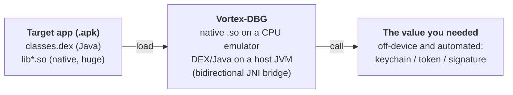

  

<h1 align="center">Vortex-DBG</h1>

<em>Emulate Android native libraries <b>and</b> DEX/Java classes, together, off-device.</em>

  
  
  
  
  
  
  

Many times, when you are reverse-engineering an app, it is far more worthwhile to take
the native library or a given Java class and just **emulate** it than to rewrite it into a
white box reimplementation. Often that is enough to validate something first, and only then
decide whether it is worth the cost of translating it to another language. That is exactly
why Vortex-DBG was created.

## Documentation

**[www.vortexdbg.reverselabs.dev](https://www.vortexdbg.reverselabs.dev)**

In the documentation you can learn about the project, how to use it to build things **for
production**, and also how to use the **MCP** integration. This README is just a quick overview.

## How it works (production, in one picture)

Say an app has a DEX class plus a giant, obfuscated native library that, together, compute
something you want, like a keychain, a request signature, or an encrypted token. Reverse
engineering all of that and rewriting it into a white box reimplementation is expensive and
brittle. Instead, Vortex-DBG loads the app's `.so` onto a CPU emulator and runs its DEX/Java
classes on a real host JVM, wired together by a bidirectional JNI bridge, so you can simply
**call the function and get the value**, batched and off-device, with no rooted phone in the loop.

## MCP tools

Beyond production, Vortex-DBG is also for **experimentation and research through MCP**. It already
ships with a large set of MCP tools, so an AI client (Claude Code, Cursor, or any MCP client) can
drive the emulator for you: poke the native (ARM) side and the Dalvik/Java (DVM) side, set
breakpoints, follow the JNI bridge, and call functions, all by conversation.

Every tool is namespaced with the `vortexdbg-` prefix. Each one below has a runnable, worked example
under [`tests/MCP/`](tests/MCP) (six demo apps and a one-command `run-all.sh`). For the full
reference and workflows, read the [documentation](https://www.vortexdbg.reverselabs.dev).

### Native (ARM) tools

| Tool | What it does | Try it in |
|---|---|---|
| `vortexdbg-check_connection` | Emulator status: architecture, backend, state, loaded modules | [01app](tests/MCP/01app) |
| `vortexdbg-list_modules` | List loaded `.so` modules (optional name filter) | [01app](tests/MCP/01app) |
| `vortexdbg-get_module_info` | A module's base, size, export count, dependencies | [01app](tests/MCP/01app) |
| `vortexdbg-list_exports` | Exported symbols of a module (optional filter, demangled) | [01app](tests/MCP/01app) |
| `vortexdbg-find_symbol` | Resolve a symbol by name, or the nearest symbol to an address | [01app](tests/MCP/01app) |
| `vortexdbg-get_threads` | List emulator threads/tasks (with args while running) | [06app](tests/MCP/06app) |
| `vortexdbg-get_registers` | Read all general-purpose registers | [01app](tests/MCP/01app) |
| `vortexdbg-get_register` | Read one register by name | [01app](tests/MCP/01app) |
| `vortexdbg-set_register` | Write one register | [01app](tests/MCP/01app) |
| `vortexdbg-disassemble` | Disassemble N instructions at an address | [01app](tests/MCP/01app) |
| `vortexdbg-disassemble_symbol` | Disassemble a function by module and symbol | [01app](tests/MCP/01app) |
| `vortexdbg-assemble` | Assemble instruction text to machine code | [01app](tests/MCP/01app) |
| `vortexdbg-read_args` | Decode the calling-convention argument registers | [01app](tests/MCP/01app) |
| `vortexdbg-read_memory` | Hex dump of memory at an address | [01app](tests/MCP/01app) |
| `vortexdbg-write_memory` | Write raw hex bytes to memory | [01app](tests/MCP/01app) |
| `vortexdbg-write_string` | Write a null-terminated C string to memory | [01app](tests/MCP/01app) |
| `vortexdbg-read_string` | Read a null-terminated C string | [01app](tests/MCP/01app) |
| `vortexdbg-read_std_string` | Read a C++ libc++ `std::string` (SSO and heap) | [03app](tests/MCP/03app) |
| `vortexdbg-read_pointer` | Follow a pointer chain with symbol resolution | [04app](tests/MCP/04app) |
| `vortexdbg-read_typed` | Read typed values (int8..int64, float, double, pointer) | [04app](tests/MCP/04app) |
| `vortexdbg-search_memory` | Search memory for a hex pattern or a string | [01app](tests/MCP/01app) |
| `vortexdbg-list_memory_map` | List mapped memory regions and permissions | [01app](tests/MCP/01app) |
| `vortexdbg-patch` | Assemble an instruction and write it to memory | [01app](tests/MCP/01app) |
| `vortexdbg-allocate_memory` | Allocate an RW scratch buffer (malloc/mmap) | [01app](tests/MCP/01app) |
| `vortexdbg-free_memory` | Free a buffer from allocate_memory | [01app](tests/MCP/01app) |
| `vortexdbg-list_allocations` | List active allocations | [01app](tests/MCP/01app) |
| `vortexdbg-add_breakpoint` | Add a breakpoint at an address | [01app](tests/MCP/01app) |
| `vortexdbg-add_breakpoint_by_symbol` | Add a breakpoint at a module symbol | [01app](tests/MCP/01app) |
| `vortexdbg-add_breakpoint_by_offset` | Add a breakpoint at module base + offset | [01app](tests/MCP/01app) |
| `vortexdbg-remove_breakpoint` | Remove a breakpoint | [01app](tests/MCP/01app) |
| `vortexdbg-list_breakpoints` | List breakpoints with disassembly | [01app](tests/MCP/01app) |
| `vortexdbg-continue_execution` | Resume execution from the current PC | [01app](tests/MCP/01app) |
| `vortexdbg-step_over` | Step over the current instruction | [01app](tests/MCP/01app) |
| `vortexdbg-step_into` | Execute N instructions then stop | [01app](tests/MCP/01app) |
| `vortexdbg-step_out` | Run until the current function returns | [01app](tests/MCP/01app) |
| `vortexdbg-next_block` | Break at the next basic block (Unicorn) | [01app](tests/MCP/01app) |
| `vortexdbg-step_until_mnemonic` | Run until the next matching mnemonic (Unicorn) | [01app](tests/MCP/01app) |
| `vortexdbg-poll_events` | Fetch queued events (breakpoint_hit, traces, completed) | [01app](tests/MCP/01app) |
| `vortexdbg-trace_code` | Trace instruction execution in an address range | [01app](tests/MCP/01app) |
| `vortexdbg-trace_read` | Trace memory reads in an address range | [01app](tests/MCP/01app) |
| `vortexdbg-trace_write` | Trace memory writes in an address range | [01app](tests/MCP/01app) |
| `vortexdbg-get_callstack` | Backtrace with module, offset, and nearest symbol | [06app](tests/MCP/06app) |
| `vortexdbg-call_function` | Call a native function by address with typed args | [01app](tests/MCP/01app) |
| `vortexdbg-call_symbol` | Call an exported function by module and symbol | [01app](tests/MCP/01app) |

### Dalvik / Java (DVM) tools

| Tool | What it does | Try it in |
|---|---|---|
| `vortexdbg-dvm_list_classes` | List the Dalvik classes resolved on the host JVM | [01app](tests/MCP/01app) |
| `vortexdbg-dvm_search_classes` | Search resolved classes by name (substring or regex) | [01app](tests/MCP/01app) |
| `vortexdbg-dvm_class_hierarchy` | A class's superclass chain and interfaces | [01app](tests/MCP/01app) |
| `vortexdbg-dvm_describe_class` | Methods and fields the VM has touched for a class | [02app](tests/MCP/02app) |
| `vortexdbg-dvm_describe_method` | Decode a JNI method signature (args and return) | [01app](tests/MCP/01app) |
| `vortexdbg-dvm_list_native_registrations` | RegisterNatives bindings per class (method to pointer) | [02app](tests/MCP/02app) |
| `vortexdbg-dvm_dex_surface` | List or search the DEX classes, methods, and strings | [01app](tests/MCP/01app) |
| `vortexdbg-dvm_call_static` | Call a static Java/native method through the bridge | [01app](tests/MCP/01app) |
| `vortexdbg-dvm_call_instance` | Call an instance method on an object handle | [01app](tests/MCP/01app) |
| `vortexdbg-dvm_oracle` | Call a method and assert the result against an expected value | [01app](tests/MCP/01app) |
| `vortexdbg-dvm_fuzz_method` | Batch-call a method over inputs and tabulate byte variance | [01app](tests/MCP/01app) |
| `vortexdbg-dvm_make_object` | Create a String/bytes/array object and return a handle | [01app](tests/MCP/01app) |
| `vortexdbg-dvm_new_object` | Construct an app object and return a handle | [01app](tests/MCP/01app) |
| `vortexdbg-dvm_new_array_object` | Build an `Object[]` from handles/strings | [01app](tests/MCP/01app) |
| `vortexdbg-dvm_pin_ref` | Promote a handle to a global ref | [01app](tests/MCP/01app) |
| `vortexdbg-dvm_release_ref` | Drop a handle from the global ref table | [01app](tests/MCP/01app) |
| `vortexdbg-dvm_list_objects` | List live JNI object refs (local and global) | [01app](tests/MCP/01app) |
| `vortexdbg-dvm_get_object` | Class and value of an object by handle | [01app](tests/MCP/01app) |
| `vortexdbg-dvm_inspect_object` | Deep view of a handle: scope, refCount, value, length | [01app](tests/MCP/01app) |
| `vortexdbg-dvm_read_string` | The Java String value of a StringObject handle | [01app](tests/MCP/01app) |
| `vortexdbg-dvm_read_array` | Typed contents of an array handle | [04app](tests/MCP/04app) |
| `vortexdbg-dvm_to_string` | Best-effort String rendering of a handle | [01app](tests/MCP/01app) |
| `vortexdbg-dvm_read_field` | Read a static or instance field | [02app](tests/MCP/02app) |
| `vortexdbg-dvm_set_field` | Write a static or instance field | [01app](tests/MCP/01app) |
| `vortexdbg-dvm_object_graph` | All live refs grouped by class or scope | [01app](tests/MCP/01app) |
| `vortexdbg-dvm_find_objects_by_class` | Live handles of a given class | [01app](tests/MCP/01app) |
| `vortexdbg-dvm_ref_table_stats` | Ref-table counts and a per-class histogram | [01app](tests/MCP/01app) |
| `vortexdbg-dvm_pending_exception` | The current pending JNI exception | [05app](tests/MCP/05app) |
| `vortexdbg-dvm_resolve_native_handle` | A native jobject/jmethodID/jfieldID to its DVM entity | [01app](tests/MCP/01app) |
| `vortexdbg-dvm_handle_to_native` | A DVM handle to its native peer, scope, and refCount | [01app](tests/MCP/01app) |
| `vortexdbg-dvm_class_of_native` | A jclass peer or `Java_` symbol to its DVM class | [02app](tests/MCP/02app) |
| `vortexdbg-dvm_args_at_breakpoint` | Decode JNI args at a native breakpoint into DVM objects | [01app](tests/MCP/01app) |
| `vortexdbg-dvm_resolve_method` | Find JNI signatures for a bare method name | [02app](tests/MCP/02app) |
| `vortexdbg-dvm_trace_jni` | Record native to Java JNI callbacks | [02app](tests/MCP/02app) |
| `vortexdbg-dvm_jni_log` | Read (and clear) the recorded JNI trace and break events | [02app](tests/MCP/02app) |
| `vortexdbg-dvm_mock_jni` | Override a JNI callback's return value | [02app](tests/MCP/02app) |
| `vortexdbg-dvm_break_on_jni` | Record a snapshot when a JNI callback fires | [01app](tests/MCP/01app) |
| `vortexdbg-dvm_spoof_env` | Install a bundle of device-identity mocks | [02app](tests/MCP/02app) |
| `vortexdbg-dvm_snapshot` | Snapshot the DVM state (classes and refs) | [01app](tests/MCP/01app) |
| `vortexdbg-dvm_diff` | Diff two DVM snapshots | [01app](tests/MCP/01app) |
| `vortexdbg-dvm_export` | Write an object, snapshot, or object graph to disk | [01app](tests/MCP/01app) |
| `vortexdbg-dvm_call_phase` | Record a sequence of tool calls and replay it | [01app](tests/MCP/01app) |

Example, in one breath: say you want to emulate a function from a banking app. You load its `.so`,
ask the AI to `vortexdbg-add_breakpoint_by_symbol`, trigger the call, then use `vortexdbg-read_args`
/ `vortexdbg-dvm_call_static` / `vortexdbg-dvm_trace_jni` to watch the native and Java conversation
and pull out what it computes. That is just the quick view. For the full workflow and the complete
tool reference, read the [documentation](https://www.vortexdbg.reverselabs.dev).

## Thanks

- [unidbg](https://github.com/zhkl0228/unidbg)
- [unicorn](https://github.com/zhkl0228/unicorn)
- [dynarmic](https://github.com/MerryMage/dynarmic)
- [HookZz](https://github.com/jmpews/Dobby)
- [xHook](https://github.com/iqiyi/xHook)
- [AndroidNativeEmu](https://github.com/AeonLucid/AndroidNativeEmu)
- [usercorn](https://github.com/lunixbochs/usercorn)
- [keystone](https://github.com/keystone-engine/keystone)
- [capstone](https://github.com/aquynh/capstone)
- [idaemu](https://github.com/36hours/idaemu)
- [jelf](https://github.com/fornwall/jelf)
- [whale](https://github.com/asLody/whale)
- [mman-win32](https://github.com/mcgarrah/mman-win32)

## License

[Apache License 2.0](LICENSE). Vortex-DBG is a derivative work based on the architecture of
[unidbg](https://github.com/zhkl0228/unidbg) (Apache-2.0). See [NOTICE](NOTICE).
