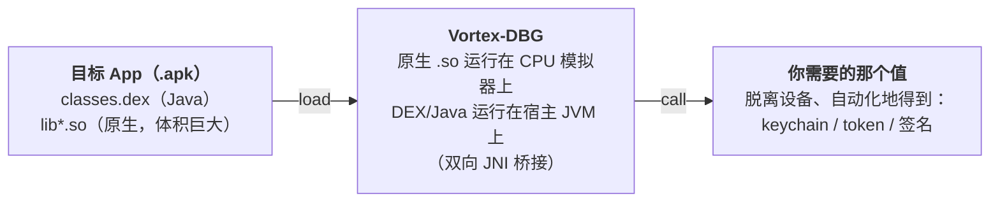

  
  

  

<h1 align="center">Vortex-DBG</h1>

<em>在脱离设备的环境中，同时模拟运行 Android 原生库<b>和</b> DEX/Java 类。</em>

  
  
  
  
  
  
  

在逆向一个 App 时，我常常发现：与其把原生库或某个 Java 类重写成一份白盒实现，不如直接把它**模拟**运行起来，这样划算得多。很多时候，先这样验证一下就足够了，之后再去判断是否值得花成本把它翻译成另一种语言。Vortex-DBG 正是为此而生。

## 文档

**[www.vortexdbg.reverselabs.dev](https://www.vortexdbg.reverselabs.dev)**

在文档中，你可以了解这个项目，学习如何用它来构建**面向生产**的方案，以及如何使用 **MCP** 集成。本 README 只是一个快速概览。

## 工作原理（生产场景，一图说明）

假设一个 App 里有一个 DEX 类，外加一个庞大且被混淆的原生库，两者协同计算出你想要的东西，比如一个 keychain、一个请求签名，或者一个加密 token。把这一切都逆向出来再重写成白盒实现，既昂贵又脆弱。相反，Vortex-DBG 会把这个 App 的 `.so` 加载到 CPU 模拟器上，并在一个真实的宿主 JVM 上运行它的 DEX/Java 类，二者通过双向 JNI 桥接连接起来，于是你可以直接**调用这个函数并拿到结果值**，批量执行、脱离设备，整个流程中不需要任何已 root 的手机。

## MCP 工具

除了生产用途之外，Vortex-DBG 同样适用于**通过 MCP 进行实验和研究**。它已经内置了一大批 MCP 工具，因此一个 AI 客户端（Claude Code、Cursor，或任何 MCP 客户端）可以替你驱动模拟器：操控原生（ARM）一侧和 Dalvik/Java（DVM）一侧，设置断点，跟踪 JNI 桥接，并调用函数，这一切都通过对话完成。

每个工具都带有 `vortexdbg-` 前缀作为命名空间。下面列出的每个工具，在 [`tests/MCP/`](tests/MCP) 下都有一个可运行的完整示例（六个演示 App，外加一条命令即可执行的 `run-all.sh`）。如需完整参考和工作流，请阅读[文档](https://www.vortexdbg.reverselabs.dev)。

### 原生（ARM）工具

| Tool | What it does | Try it in |
|---|---|---|
| `vortexdbg-check_connection` | 模拟器状态：架构、后端、运行状态、已加载模块 | [01app](tests/MCP/01app) |
| `vortexdbg-list_modules` | 列出已加载的 `.so` 模块（可按名称过滤） | [01app](tests/MCP/01app) |
| `vortexdbg-get_module_info` | 某个模块的基址、大小、导出数量、依赖项 | [01app](tests/MCP/01app) |
| `vortexdbg-list_exports` | 某个模块的导出符号（可过滤，已 demangle） | [01app](tests/MCP/01app) |
| `vortexdbg-find_symbol` | 按名称解析符号，或查找距某地址最近的符号 | [01app](tests/MCP/01app) |
| `vortexdbg-get_threads` | 列出模拟器线程/任务（运行中时附带参数） | [06app](tests/MCP/06app) |
| `vortexdbg-get_registers` | 读取所有通用寄存器 | [01app](tests/MCP/01app) |
| `vortexdbg-get_register` | 按名称读取单个寄存器 | [01app](tests/MCP/01app) |
| `vortexdbg-set_register` | 写入单个寄存器 | [01app](tests/MCP/01app) |
| `vortexdbg-disassemble` | 反汇编某地址处的 N 条指令 | [01app](tests/MCP/01app) |
| `vortexdbg-disassemble_symbol` | 按模块和符号反汇编一个函数 | [01app](tests/MCP/01app) |
| `vortexdbg-assemble` | 将指令文本汇编为机器码 | [01app](tests/MCP/01app) |
| `vortexdbg-read_args` | 解码调用约定的参数寄存器 | [01app](tests/MCP/01app) |
| `vortexdbg-read_memory` | 以十六进制转储某地址处的内存 | [01app](tests/MCP/01app) |
| `vortexdbg-write_memory` | 向内存写入原始十六进制字节 | [01app](tests/MCP/01app) |
| `vortexdbg-write_string` | 向内存写入一个以 null 结尾的 C 字符串 | [01app](tests/MCP/01app) |
| `vortexdbg-read_string` | 读取一个以 null 结尾的 C 字符串 | [01app](tests/MCP/01app) |
| `vortexdbg-read_std_string` | 读取一个 C++ libc++ 的 `std::string`（SSO 与堆两种情形） | [03app](tests/MCP/03app) |
| `vortexdbg-read_pointer` | 跟随指针链并解析符号 | [04app](tests/MCP/04app) |
| `vortexdbg-read_typed` | 读取带类型的值（int8..int64、float、double、pointer） | [04app](tests/MCP/04app) |
| `vortexdbg-search_memory` | 在内存中搜索十六进制模式或字符串 | [01app](tests/MCP/01app) |
| `vortexdbg-list_memory_map` | 列出已映射的内存区域及其权限 | [01app](tests/MCP/01app) |
| `vortexdbg-patch` | 汇编一条指令并将其写入内存 | [01app](tests/MCP/01app) |
| `vortexdbg-allocate_memory` | 分配一块可读写的临时缓冲区（malloc/mmap） | [01app](tests/MCP/01app) |
| `vortexdbg-free_memory` | 释放由 allocate_memory 分配的缓冲区 | [01app](tests/MCP/01app) |
| `vortexdbg-list_allocations` | 列出当前活跃的内存分配 | [01app](tests/MCP/01app) |
| `vortexdbg-add_breakpoint` | 在某地址处添加断点 | [01app](tests/MCP/01app) |
| `vortexdbg-add_breakpoint_by_symbol` | 在某模块符号处添加断点 | [01app](tests/MCP/01app) |
| `vortexdbg-add_breakpoint_by_offset` | 在模块基址 + 偏移处添加断点 | [01app](tests/MCP/01app) |
| `vortexdbg-remove_breakpoint` | 移除一个断点 | [01app](tests/MCP/01app) |
| `vortexdbg-list_breakpoints` | 列出断点并附带反汇编 | [01app](tests/MCP/01app) |
| `vortexdbg-continue_execution` | 从当前 PC 处恢复执行 | [01app](tests/MCP/01app) |
| `vortexdbg-step_over` | 单步跳过当前指令 | [01app](tests/MCP/01app) |
| `vortexdbg-step_into` | 执行 N 条指令后停止 | [01app](tests/MCP/01app) |
| `vortexdbg-step_out` | 运行直到当前函数返回 | [01app](tests/MCP/01app) |
| `vortexdbg-next_block` | 在下一个基本块处中断（Unicorn） | [01app](tests/MCP/01app) |
| `vortexdbg-step_until_mnemonic` | 运行直到下一条匹配的助记符（Unicorn） | [01app](tests/MCP/01app) |
| `vortexdbg-poll_events` | 获取排队的事件（breakpoint_hit、traces、completed） | [01app](tests/MCP/01app) |
| `vortexdbg-trace_code` | 跟踪某地址范围内的指令执行 | [01app](tests/MCP/01app) |
| `vortexdbg-trace_read` | 跟踪某地址范围内的内存读取 | [01app](tests/MCP/01app) |
| `vortexdbg-trace_write` | 跟踪某地址范围内的内存写入 | [01app](tests/MCP/01app) |
| `vortexdbg-get_callstack` | 回溯调用栈，附带模块、偏移和最近符号 | [06app](tests/MCP/06app) |
| `vortexdbg-call_function` | 按地址调用一个原生函数，传入带类型的参数 | [01app](tests/MCP/01app) |
| `vortexdbg-call_symbol` | 按模块和符号调用一个导出函数 | [01app](tests/MCP/01app) |

### Dalvik / Java（DVM）工具

| Tool | What it does | Try it in |
|---|---|---|
| `vortexdbg-dvm_list_classes` | 列出在宿主 JVM 上已解析的 Dalvik 类 | [01app](tests/MCP/01app) |
| `vortexdbg-dvm_search_classes` | 按名称搜索已解析的类（子串或正则） | [01app](tests/MCP/01app) |
| `vortexdbg-dvm_class_hierarchy` | 某个类的父类链与接口 | [01app](tests/MCP/01app) |
| `vortexdbg-dvm_describe_class` | 虚拟机为某个类已触及的方法和字段 | [02app](tests/MCP/02app) |
| `vortexdbg-dvm_describe_method` | 解码一个 JNI 方法签名（参数与返回值） | [01app](tests/MCP/01app) |
| `vortexdbg-dvm_list_native_registrations` | 每个类的 RegisterNatives 绑定（方法到指针） | [02app](tests/MCP/02app) |
| `vortexdbg-dvm_dex_surface` | 列出或搜索 DEX 的类、方法和字符串 | [01app](tests/MCP/01app) |
| `vortexdbg-dvm_call_static` | 通过桥接调用一个静态 Java/原生方法 | [01app](tests/MCP/01app) |
| `vortexdbg-dvm_call_instance` | 在某个对象句柄上调用实例方法 | [01app](tests/MCP/01app) |
| `vortexdbg-dvm_oracle` | 调用一个方法并将结果与预期值做断言 | [01app](tests/MCP/01app) |
| `vortexdbg-dvm_fuzz_method` | 对一组输入批量调用某方法，并列出字节差异 | [01app](tests/MCP/01app) |
| `vortexdbg-dvm_make_object` | 创建一个 String/字节/数组对象并返回句柄 | [01app](tests/MCP/01app) |
| `vortexdbg-dvm_new_object` | 构造一个 App 对象并返回句柄 | [01app](tests/MCP/01app) |
| `vortexdbg-dvm_new_array_object` | 用句柄/字符串构建一个 `Object[]` | [01app](tests/MCP/01app) |
| `vortexdbg-dvm_pin_ref` | 将一个句柄提升为全局引用 | [01app](tests/MCP/01app) |
| `vortexdbg-dvm_release_ref` | 从全局引用表中丢弃一个句柄 | [01app](tests/MCP/01app) |
| `vortexdbg-dvm_list_objects` | 列出活跃的 JNI 对象引用（局部与全局） | [01app](tests/MCP/01app) |
| `vortexdbg-dvm_get_object` | 按句柄获取对象的类与值 | [01app](tests/MCP/01app) |
| `vortexdbg-dvm_inspect_object` | 深入查看一个句柄：作用域、refCount、值、长度 | [01app](tests/MCP/01app) |
| `vortexdbg-dvm_read_string` | StringObject 句柄对应的 Java String 值 | [01app](tests/MCP/01app) |
| `vortexdbg-dvm_read_array` | 数组句柄的带类型内容 | [04app](tests/MCP/04app) |
| `vortexdbg-dvm_to_string` | 尽力将一个句柄渲染为 String | [01app](tests/MCP/01app) |
| `vortexdbg-dvm_read_field` | 读取一个静态或实例字段 | [02app](tests/MCP/02app) |
| `vortexdbg-dvm_set_field` | 写入一个静态或实例字段 | [01app](tests/MCP/01app) |
| `vortexdbg-dvm_object_graph` | 按类或作用域分组的所有活跃引用 | [01app](tests/MCP/01app) |
| `vortexdbg-dvm_find_objects_by_class` | 某个给定类的活跃句柄 | [01app](tests/MCP/01app) |
| `vortexdbg-dvm_ref_table_stats` | 引用表计数及按类划分的直方图 | [01app](tests/MCP/01app) |
| `vortexdbg-dvm_pending_exception` | 当前待处理的 JNI 异常 | [05app](tests/MCP/05app) |
| `vortexdbg-dvm_resolve_native_handle` | 将原生 jobject/jmethodID/jfieldID 解析为其 DVM 实体 | [01app](tests/MCP/01app) |
| `vortexdbg-dvm_handle_to_native` | 将一个 DVM 句柄解析为其原生对应物、作用域和 refCount | [01app](tests/MCP/01app) |
| `vortexdbg-dvm_class_of_native` | 将一个 jclass 对应物或 `Java_` 符号解析为其 DVM 类 | [02app](tests/MCP/02app) |
| `vortexdbg-dvm_args_at_breakpoint` | 在原生断点处将 JNI 参数解码为 DVM 对象 | [01app](tests/MCP/01app) |
| `vortexdbg-dvm_resolve_method` | 为一个裸方法名查找其 JNI 签名 | [02app](tests/MCP/02app) |
| `vortexdbg-dvm_trace_jni` | 记录从原生到 Java 的 JNI 回调 | [02app](tests/MCP/02app) |
| `vortexdbg-dvm_jni_log` | 读取（并清空）已记录的 JNI 跟踪和中断事件 | [02app](tests/MCP/02app) |
| `vortexdbg-dvm_mock_jni` | 覆盖一个 JNI 回调的返回值 | [02app](tests/MCP/02app) |
| `vortexdbg-dvm_break_on_jni` | 当某个 JNI 回调触发时记录一次快照 | [01app](tests/MCP/01app) |
| `vortexdbg-dvm_spoof_env` | 安装一组设备身份相关的模拟数据 | [02app](tests/MCP/02app) |
| `vortexdbg-dvm_snapshot` | 对 DVM 状态（类与引用）拍快照 | [01app](tests/MCP/01app) |
| `vortexdbg-dvm_diff` | 对比两份 DVM 快照 | [01app](tests/MCP/01app) |
| `vortexdbg-dvm_export` | 将一个对象、快照或对象图写入磁盘 | [01app](tests/MCP/01app) |
| `vortexdbg-dvm_call_phase` | 记录一段工具调用序列并回放它 | [01app](tests/MCP/01app) |

举个一气呵成的例子：假设你想模拟一个银行 App 里的某个函数。你加载它的 `.so`，让 AI 执行 `vortexdbg-add_breakpoint_by_symbol`，触发该调用，然后用 `vortexdbg-read_args` / `vortexdbg-dvm_call_static` / `vortexdbg-dvm_trace_jni` 来观察原生侧与 Java 侧之间的交流，并提取出它所计算的内容。这只是一个快速一瞥。如需完整工作流和完整的工具参考，请阅读[文档](https://www.vortexdbg.reverselabs.dev)。

## 致谢

- [unidbg](https://github.com/zhkl0228/unidbg)
- [unicorn](https://github.com/zhkl0228/unicorn)
- [dynarmic](https://github.com/MerryMage/dynarmic)
- [HookZz](https://github.com/jmpews/Dobby)
- [xHook](https://github.com/iqiyi/xHook)
- [AndroidNativeEmu](https://github.com/AeonLucid/AndroidNativeEmu)
- [usercorn](https://github.com/lunixbochs/usercorn)
- [keystone](https://github.com/keystone-engine/keystone)
- [capstone](https://github.com/aquynh/capstone)
- [idaemu](https://github.com/36hours/idaemu)
- [jelf](https://github.com/fornwall/jelf)
- [whale](https://github.com/asLody/whale)
- [mman-win32](https://github.com/mcgarrah/mman-win32)

## 许可证

[Apache License 2.0](LICENSE)。Vortex-DBG 是基于 [unidbg](https://github.com/zhkl0228/unidbg)（Apache-2.0）架构的衍生作品。参见 [NOTICE](NOTICE)。
